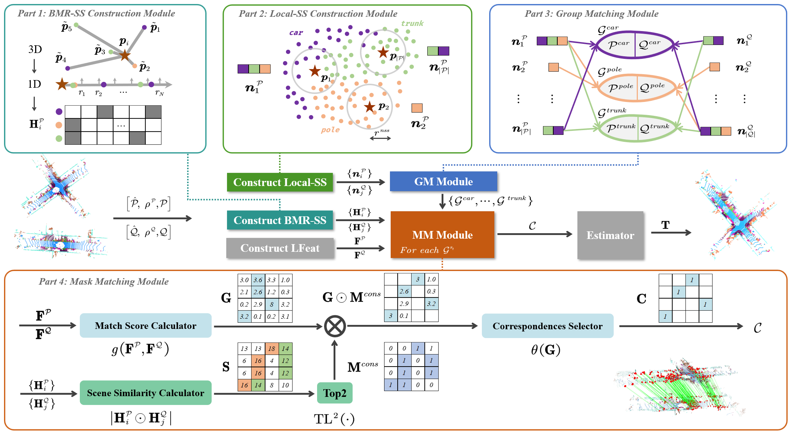

<div align="center">
<h1>ML-SemReg</h1>
<h3>ML-SemReg: Boosting Point Cloud Registration with Multi-level Semantic Consistency</h3>

[Shaocheng Yan](https://github.com/Laka-3DV)<sup>1</sup>,
[Pengcheng Shi](https://orcid.org/0000-0003-2504-9890)<sup>2</sup>,
[Jiayuan Li](https://ljy-rs.github.io/web/)<sup>1 :email:</sup>

<sup>1</sup>School of Remote Sensing and Information Engineering, Wuhan University, 
<sup>2</sup>School of Computer Science, Wuhan University

(\*) equal contribution, (<sup>:email:</sup>) corresponding author.


ML-SemReg is a new **plug-and-play method** for **boosting** point cloud registration utilize multi-level semantic consistency. Its core idea is to address **inter- and intra-class** mismatchings (outliers) ultilizing semantic information of point clouds.

<!-- ArXiv Preprint ([]()), HuggingFace Page ([🤗 ()) -->


</div>




# Demo

Installation
```shell
conda create -n mlsemreg python=3.9 
conda activate mlsemreg
pip install -r requirements.txt

# please check your CUDA version
pip install torch==1.13.1+cu117 torchvision==0.14.1+cu117 torchaudio==0.13.1 --extra-index-url https://download.pytorch.org/whl/cu117
```

Run `demo.py`

```shell
# a demo using KITTI medium dataset
python -m demo
python -m demo -is_vis
```


# Citation

If you use this codebase, or otherwise find our work valuable, please cite ML-SemReg:
```
TODO
```

# Acknowledgements 

- [Pointcept](https://github.com/Pointcept/Pointcept)
- [SC2-PCR](https://github.com/ZhiChen902/SC2-PCR)
